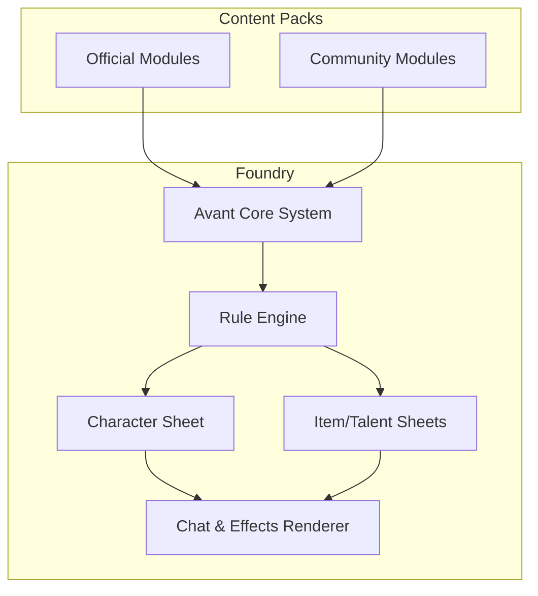

# AvantVTT · Product Requirements Document

**Version:** 0.2.0 • Status: Working Draft

| Version | Date       | Author                | Notes             |   |   |   |
| ------- | ---------- | --------------------- | ----------------- | - | - | - |
| 0.1.0   | 2025‑07‑28 | AvantVTT Design Group | Initial draft     |   |   |   |
| 0.2.0   | 2025‑07‑29 | AvantVTT Design Group | Revised draft     |   |   |   |
| *TODO*  | *DATE*     | *NAME*                | *Describe change* |   |   |   |

---

## Table of Contents

1. Introduction
2. Background & Problem Statement
3. Goals & Non‑Goals
4. Objectives & Success Metrics
5. Personas & User Needs
6. Scope
7. Functional Requirements
8. Non‑Functional Requirements
9. Architecture Overview
10. Risks & Mitigations
11. Analytics & Instrumentation Strategy
12. Launch & Support Plan
13. Dependencies
14. Roadmap & Milestones
15. Glossary
16. Appendix

---

## 1 · Introduction

### 1.1 Purpose

Provide a single source of truth that captures **what** AvantVTT will deliver and **why**, enabling aligned execution across product, design, and engineering.

### 1.2 Scope

Covers gameplay mechanics, user experience, technical architecture, and operational considerations required for a market‑viable MVP and subsequent releases.

### 1.3 Vision

*“Empower every GM to craft cinematic, rules‑light adventures with zero prep friction and full narrative control—while giving players intuitive, tactile tools to explore, improvise, and grow heroic characters.”*

---

## 2 · Background & Problem Statement

> **TODO:** Describe the pain points in current Foundry/PF2e workflows, quantify market gap, and articulate opportunity.

---

## 3 · Goals & Non‑Goals

### 3.1 Goals

* *Example:* Decrease average onboarding time for new systems by 50 %.
* *Example:* Enable third‑party rule modules without code changes to core.

### 3.2 Non‑Goals / Out‑of‑Scope

* *Example:* Native mobile client.
* *Example:* Supporting legacy Foundry versions prior to v13.

> **TODO:** Finalise with stakeholders.

---

## 4 · Objectives & Success Metrics

| Objective                 | KPI                                            | Target                   | Measurement Method            |
| ------------------------- | ---------------------------------------------- | ------------------------ | ----------------------------- |
| Frictionless Setup        | Time from world creation to first scene launch | ≤ 3 min P90              | Instrumented onboarding timer |
| Narrative‑First Mechanics | Net Promoter Score                             | ≥ 40                     | Post‑session survey           |
| Extensibility             | External modules adopting CONFIG hook          | ≥ 5 within 3 mo          | GitHub Marketplace count      |
| Accessibility             | WCAG 2.2 AA pass rate                          | 100 % of audited screens | Axe automated tests           |

> **TODO:** Review targets & add retention metric.

---

## 5 · Personas & User Needs

| Persona              | Key Needs                                |
| -------------------- | ---------------------------------------- |
| **Narrator GM**      | Fast rulings; flexible narrative control |
| **Cinematic Player** | Flashy actions; minimal math             |
| **Tactician**        | Build depth; system mastery              |

> **TODO:** Expand with JTBD statements and link to research.

---

## 6 · Scope

### 6.1 In‑Scope

* Core rule engine (2d10 task resolution, PP economy)
* Character & Item sheets (React, Vite)
* Starter content packs

### 6.2 Out‑of‑Scope (deferred)

* Voice/video integration
* Full 3D virtual tabletop

---

## 7 · Functional Requirements

| ID   | Requirement                                                | Acceptance Criteria                                            | Spec Link         |
| ---- | ---------------------------------------------------------- | -------------------------------------------------------------- | ----------------- |
| FR‑1 | As a player, I can make a task roll using 2d10 + modifiers | Dice result, degrees of success rendered in chat within 300 ms | 03.1‑task‑roll.md |
| FR‑2 | ...                                                        | ...                                                            | ...               |

> **TODO:** Complete detailed FR list.

### 7.1 Core Game Mechanics

*Imported from previous draft; review & refine:*

* **Universal Task Resolution** – 2d10 + Stat + Skill vs Difficulty; Degrees of Success.
* **Spotlight Economy** – Potential Points earned on fails, spent for bonuses.
* **Talent & Augment System** – Modular talent trees and consumable augments.
* **Cinematic Combat Loop** – Initiative bands; abstract ranges.

---

## 8 · Non‑Functional Requirements

*Reused from draft—verify thresholds:*

| Category             | Requirement                                                    |
| -------------------- | -------------------------------------------------------------- |
| Performance          | Client‑side only; virtualised lists; 60 FPS on mid‑tier laptop |
| Security             | Validate all JSON imports; sandbox macros                      |
| Accessibility        | Full keyboard nav; color‑blind‑safe palette                    |
| Internationalisation | All UI strings externalised                                    |
| Testing              | ≥ 90 % unit coverage on rule engine                            |

---

## 9 · Architecture Overview

> Detailed TDD lives in `/docs/architecture`.

---

## 10 · Risks & Mitigations

| Risk                                        | Likelihood | Impact | Mitigation                              |
| ------------------------------------------- | ---------- | ------ | --------------------------------------- |
| Performance drops with 100+ tokens          | Medium     | High   | Virtual scrolling; web‑worker dice calc |
| Complexity creep defeats “rules‑light” goal | High       | Medium | Product gate on new mechanics           |
| *TODO*                                      |            |        |                                         |

---

## 11 · Analytics & Instrumentation Strategy

* Track onboarding funnel, PP spend frequency, frame‑rate samples.
* Use Foundry’s telemetry hooks; pipe to open‑source ClickHouse.

> **TODO:** Define event schema.

---

## 12 · Launch & Support Plan

* **Alpha:** Closed group of 5 tables → feedback survey.
* **Beta:** Itch.io module distribution + Discord support.
* **1.0 GA:** Foundry Bazaar listing, documentation site, tutorial videos.

> **TODO:** Owner & timeline.

---

## 13 · Dependencies

* Foundry VTT 13.x (ESM build, PixiJS 7)
* TypeScript 5+, Vite, Vitest, SCSS
* Optional: Simple‑Peer for voice/video

---

## 14 · Roadmap & Milestones

1. **MVP Core** – Rule engine, character sheet, basic rolls. fileciteturn2file2L45-L47
2. **Combat Bands & PP Economy**
3. **Talent & Augment Framework**
4. **Theming & Accessibility Pass**
5. **Official Adventure Pack + Docs**

---

## 15 · Glossary

| Term     | Definition                                          |
| -------- | --------------------------------------------------- |
| **PP**   | Potential Points – meta‑currency earned on failures |
| **Band** | Initiative grouping where players act in any order  |
| *TODO*   |                                                     |

---

## 16 · Appendix

### 16.1 Open Questions

* How granular should range categories be
* Will PP economy scale beyond 5 players?
* Should talent trees be JSON‑driven for modding?&#x20;

---

*Prepared by AvantVTT Product Team – 2025‑07‑29*
